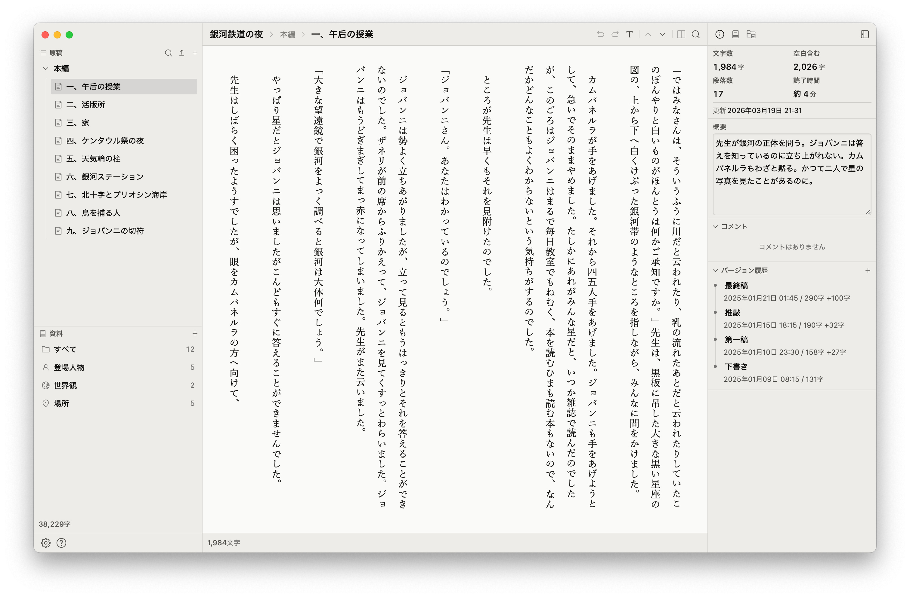

**日本語** | [English](README.md)

# 雫エディター

作家のためのデスクトップ執筆アプリです。

ルビ・傍点・縦中横といった日本語組版をエディタ上でそのまま扱えます。章とシーンで原稿を構成し、登場人物や世界観のメモをシーンに紐付けて管理できます。

## スクリーンショット



## 主な機能

- **章・シーン構成** — アウトライン形式で原稿を整理。ドラッグ&ドロップで並べ替え
- **日本語組版エディタ** — ルビ、傍点、縦中横に対応したテキストエディタ
- **分割表示** — 2つのシーンを並べて見比べながら執筆
- **バージョン履歴** — シーンのスナップショットを保存。差分をインラインで確認
- **ナレッジベース** — 登場人物・世界観・場所などの設定資料をシーンにリンク
- **参考画像** — シーンごとに画像を添付
- **エクスポート** — TXT / DOCX / PDF / ePub 出力
- **横断検索** — プロジェクト内の全シーンを対象に検索・置換
- **フォーカスモード** — 編集中の段落以外を薄くして集中
- **バックアップ** — 自動・手動でデータベースをバックアップ・復元
- **ダークモード対応**
- **日本語 / 英語 UI**

## インストール

[Releases](https://github.com/riki-nishida/shizuku-editor/releases) ページからダウンロードしてください。

macOS (Apple Silicon / Intel)・Windows・Linux に対応しています。

### 技術スタック

- **フロントエンド**: React 19, TypeScript, Vite 7, Jotai, TipTap 3, Ark UI, CSS Modules
- **バックエンド**: Rust, Tauri 2, SQLite
- **リンター**: Biome
- **テスト**: Vitest

### プロジェクト構成

```
src/
  app/          # エントリーポイント、グローバルフック
  layout/       # レイアウト
  features/     # 機能モジュール
  shared/       # 共有 UI・ユーティリティ・フック・ステート
src-tauri/
  src/
    commands/   # IPC コマンドハンドラー
    services/   # ロジック
    repositories/ # データベースアクセス
    models/     # データ型
    db/         # DB 初期化・マイグレーション
```

## コントリビューション

バグ報告や機能の提案は [Issues](https://github.com/riki-nishida/shizuku-editor/issues) からお願いします。

**プルリクエストは受け付けていません**。詳しくは [CONTRIBUTING.md](CONTRIBUTING.md) をご覧ください。

## ライセンス

[MIT](LICENSE)

## 謝辞

- サンプル作品: 宮沢賢治「[銀河鉄道の夜](https://www.aozora.gr.jp/)」（パブリックドメイン）
- サンプル作品: オスカー・ワイルド「[幸福な王子](https://www.gutenberg.org/)」（パブリックドメイン）
