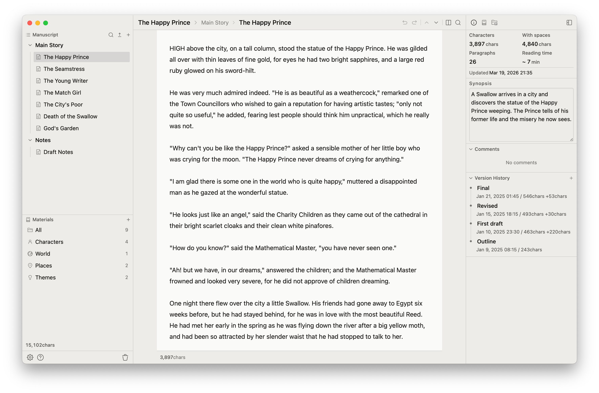

[日本語](README.ja.md) | **English**

# Shizuku Editor

A desktop writing app for authors.

Shizuku Editor handles Japanese typography — ruby, emphasis dots, and tate-chu-yoko — right in the editor. Organize your manuscript into chapters and scenes, and link character profiles, world-building notes, and other references directly to each scene.

## Screenshots



## Features

- **Chapters & Scenes** — Outline-based manuscript organization with drag & drop reordering
- **Japanese Typography Editor** — Rich text editor with ruby, emphasis dots, and tate-chu-yoko support
- **Split View** — View and edit two scenes side by side
- **Version History** — Save scene snapshots and review changes with inline diffs
- **Knowledge Base** — Link character profiles, world-building, locations, and other notes to scenes
- **Reference Images** — Attach images to scenes
- **Export** — TXT / DOCX / PDF / ePub output
- **Project-wide Search** — Search and replace across all scenes
- **Focus Mode** — Dim inactive paragraphs to stay focused
- **Backup** — Automatic and manual database backup & restore
- **Dark Mode**
- **Japanese / English UI**

## Installation

Download from the [Releases](https://github.com/riki-nishida/shizuku-editor/releases) page.

Supports macOS (Apple Silicon / Intel), Windows, and Linux.

### Tech Stack

- **Frontend**: React 19, TypeScript, Vite 7, Jotai, TipTap 3, Ark UI, CSS Modules
- **Backend**: Rust, Tauri 2, SQLite (SQLx)
- **Linting**: Biome
- **Testing**: Vitest

### Project Structure

```
src/
  app/          # Entry point, global hooks
  layout/       # Layout
  features/     # Feature modules
  shared/       # Shared UI, utilities, hooks, state
src-tauri/
  src/
    commands/   # IPC command handlers
    services/   # logic
    repositories/ # Database access
    models/     # Data types
    db/         # DB initialization & migrations
```

## Contributing

Bug reports and feature suggestions are welcome via [Issues](https://github.com/riki-nishida/shizuku-editor/issues).

**Pull requests are not accepted** at this time. See [CONTRIBUTING.md](CONTRIBUTING.md) for details.

## License

[MIT](LICENSE)

## Acknowledgments

- Sample text: Kenji Miyazawa, [Night on the Galactic Railroad](https://www.aozora.gr.jp/) (Public Domain)
- Sample text: Oscar Wilde, [The Happy Prince](https://www.gutenberg.org/) (Public Domain)
